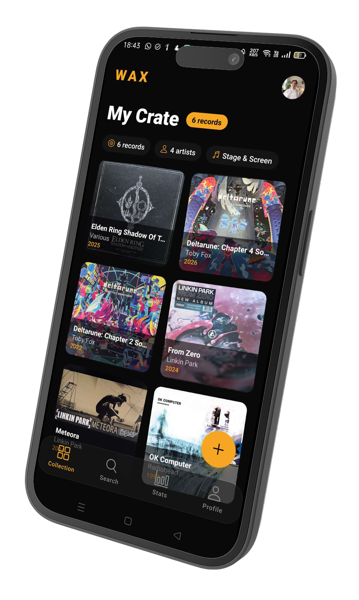
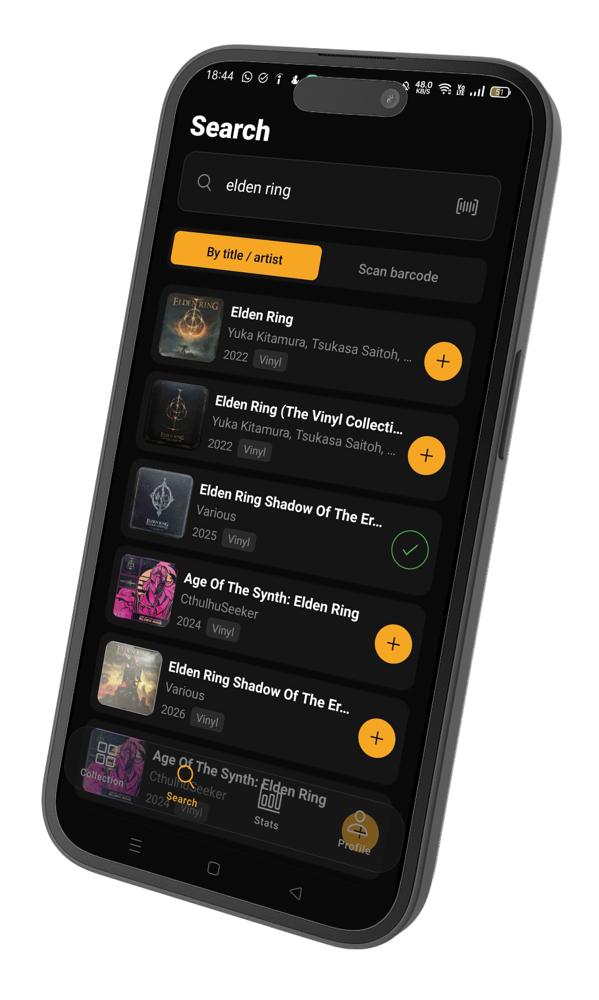
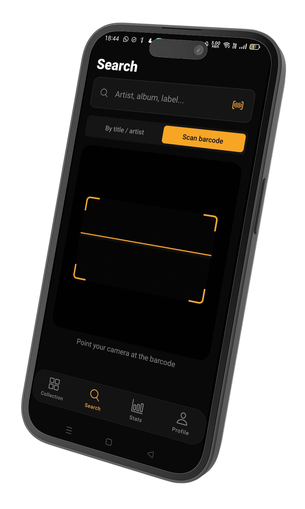
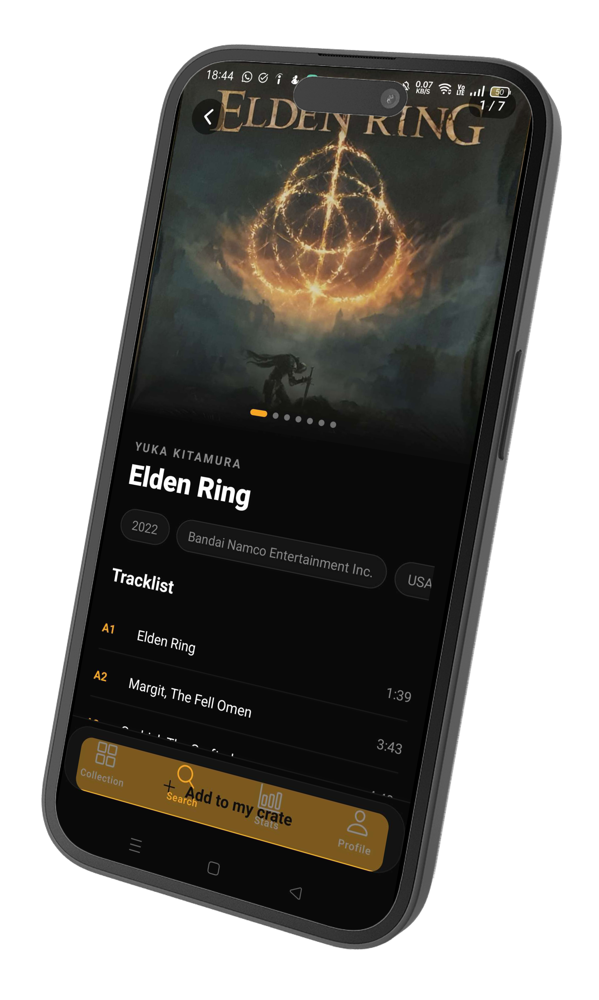
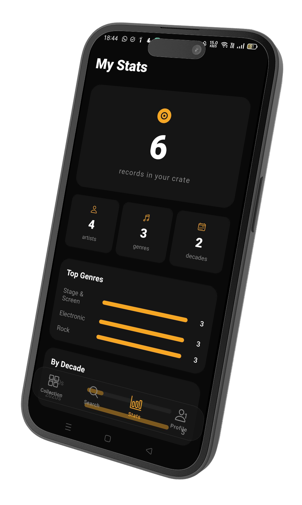

# WAX 📀

> Your vinyl library, in your pocket.

<!-- 📸 IMAGE SUGGESTION #1 : Banner/Hero -->
<!-- Une image horizontale 1280x640px montrant le logo WAX sur fond noir avec l'accent amber -->
<!-- Ou un montage de 3-4 screenshots de l'app côte à côte -->
<div style="text-align: center;">
  
</div>

---

## What is WAX?

WAX is a mobile-first vinyl record collection app built for collectors who want to manage their crate simply and beautifully. Search millions of records via the Discogs database, scan barcodes at the record shop, and explore your collection stats — all from your phone.

---

## Screenshots

<!-- 📸 IMAGE SUGGESTION #2 : Screenshots en ligne -->
<!-- 5 screenshots côte à côte dans un mockup téléphone : Collection, Search, Scanner, Record Detail, Profile -->
<!-- Taille recommandée : 390x844px par screenshot, fond transparent ou noir -->

| Collection | Search | Barcode Scanner | Record Detail | Stats |
|:---:|:---:|:---:|:---:|:---:|
|  |  |  |  |  |

---

## Features

- 📀 **Collection grid** — Browse your crate with full album artwork
- 🔍 **Search** — Find any record via the Discogs API (title, artist, label)
- 📷 **Barcode scanner** — Scan EAN-13 barcodes directly at the record shop
- 🎨 **Record detail** — Swipeable image carousel, tracklist, and release info
- 📊 **Stats** — Visualize your collection by genre, decade and artist
- 👤 **Profile** — Custom avatar, username, and account management
- 🔐 **Auth** — Email/password and Google Sign-In via Supabase

---

## Tech Stack

| Category | Technology |
|---|---|
| Framework | React Native + Expo (SDK 57) |
| Navigation | Expo Router (file-based) |
| Backend & Auth | Supabase (PostgreSQL + Auth + Storage) |
| State management | Zustand |
| Vinyl database | Discogs API |
| Styling | StyleSheet (React Native) |
| Build & Deploy | EAS Build |

---

## Project Structure

```
wax/
├── app/
│   ├── _layout.tsx           # Root layout — auth guard
│   ├── (auth)/               # Login, Register, Forgot Password
│   └── (tabs)/               # Collection, Search, Stats, Profile
│       └── search/
│           └── record/[id]   # Record detail page
├── components/
│   ├── ui/                   # Skeleton, Avatar, SplashScreen...
│   └── scanner/              # BarcodeScanner component
├── lib/
│   ├── supabase.ts           # Supabase client
│   └── discogs.ts            # Discogs API wrapper
├── stores/
│   ├── authStore.ts          # Zustand — session
│   ├── collectionStore.ts    # Zustand — vinyl collection
│   └── profileStore.ts       # Zustand — user profile
├── types/
│   └── index.ts              # Shared TypeScript types
└── constants/
    └── theme.ts              # Colors, spacing, border radius
```

---

## Getting Started

### Prerequisites

- Node.js 18+
- Expo CLI
- A [Supabase](https://supabase.com) project
- A [Discogs](https://www.discogs.com/settings/developers) API key

### Installation

```bash
# Clone the repository
git clone https://github.com/your-username/wax.git
cd wax

# Install dependencies
npm install --legacy-peer-deps

# Create your environment file
cp .env.example .env
```

### Environment Variables

Create a `.env` file at the root of the project:

```bash
EXPO_PUBLIC_SUPABASE_URL=your_supabase_project_url
EXPO_PUBLIC_SUPABASE_ANON_KEY=your_supabase_anon_key
EXPO_PUBLIC_DISCOGS_KEY=your_discogs_consumer_key
EXPO_PUBLIC_DISCOGS_SECRET=your_discogs_consumer_secret
```

### Database Setup

Run the following SQL in your Supabase SQL Editor:

```sql
-- Records table
create table records (
  id uuid default gen_random_uuid() primary key,
  user_id uuid references auth.users on delete cascade,
  discogs_id integer not null,
  title text not null,
  artist text not null,
  year integer,
  label text,
  country text,
  cover_url text,
  genres text[],
  added_at timestamp with time zone default now(),
  unique(user_id, discogs_id)
);

alter table records enable row level security;
create policy "Users can only access their own records"
  on records for all using (auth.uid() = user_id);

-- Profiles table
create table profiles (
  id uuid references auth.users on delete cascade primary key,
  username text unique,
  avatar_url text,
  updated_at timestamp with time zone default now()
);

alter table profiles enable row level security;
create policy "Users can manage their own profile"
  on profiles for all using (auth.uid() = id);

-- Auto-create profile on signup
create or replace function handle_new_user()
returns trigger as $$
begin
  insert into public.profiles (id, username, avatar_url)
  values (
    new.id,
    coalesce(new.raw_user_meta_data->>'full_name', split_part(new.email, '@', 1)),
    new.raw_user_meta_data->>'avatar_url'
  )
  on conflict (id) do nothing;
  return new;
end;
$$ language plpgsql security definer;

create trigger on_auth_user_created
  after insert on auth.users
  for each row execute procedure handle_new_user();
```

### Storage Setup

Create a public bucket named `avatars` in Supabase Storage, then run:

```sql
create policy "Avatar images are publicly accessible"
  on storage.objects for select using (bucket_id = 'avatars');

create policy "Users can upload their own avatar"
  on storage.objects for insert
  with check (bucket_id = 'avatars' AND auth.uid()::text = (storage.foldername(name))[1]);

create policy "Users can update their own avatar"
  on storage.objects for update
  using (bucket_id = 'avatars' AND auth.uid()::text = (storage.foldername(name))[1]);
```

### Run the app

```bash
npx expo start --clear
```

Scan the QR code with **Expo Go** on your phone, or press `a` to open on an Android emulator.

---

## Build

This project uses [EAS Build](https://docs.expo.dev/build/introduction/) for native builds.

```bash
# Install EAS CLI
npm install -g eas-cli

# Login
eas login

# Build a preview APK (Android)
eas build --platform android --profile preview
```

<!-- 📸 IMAGE SUGGESTION #3 : QR code ou lien de téléchargement APK -->
<!-- Un QR code pointant vers le lien de téléchargement de l'APK -->
<!-- À placer ici une fois le build publié -->

---

## Roadmap

- [ ] Discogs OAuth — import your existing Discogs collection
- [ ] Collection sharing — share your crate with friends
- [ ] iOS build & App Store release
- [ ] Web version — [wax-web](https://github.com/your-username/wax-web)

---

## Related

- [wax-web](https://github.com/Ev0gs/WaxWeb) — The Next.js web companion (password reset, future landing page)
- [Discogs API](https://www.discogs.com/developers/) — The vinyl database powering WAX
- [Supabase](https://supabase.com) — Backend & auth

---

## License

MIT — feel free to use this project as inspiration for your own.

---

<p align="center">
  Built with 🎵 and too many vinyl records
</p>